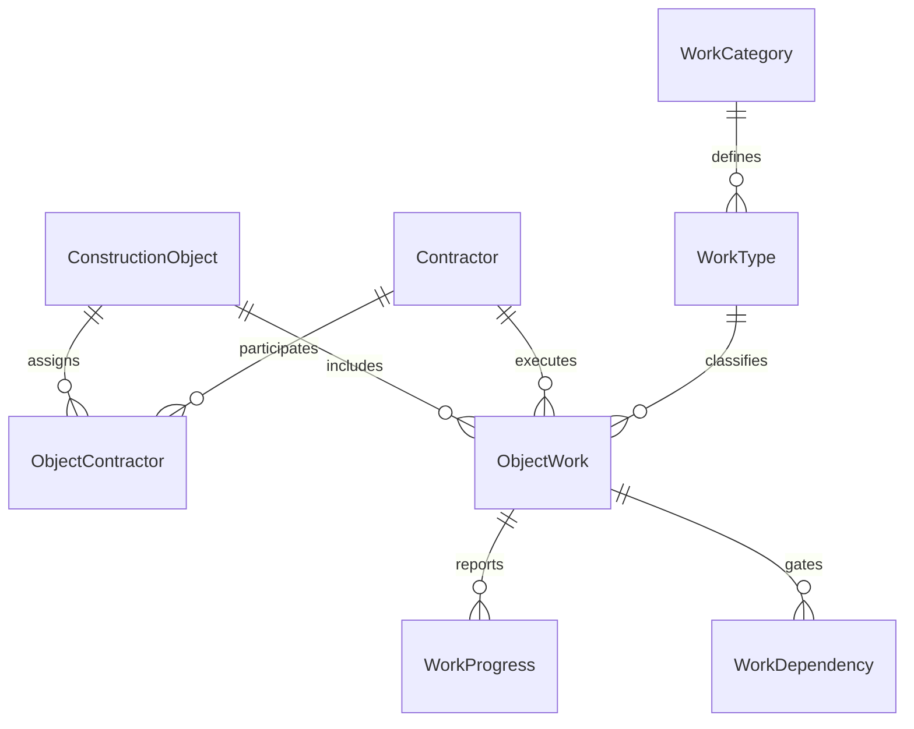
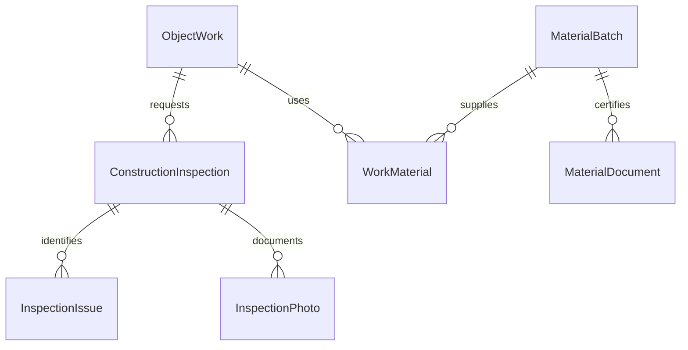
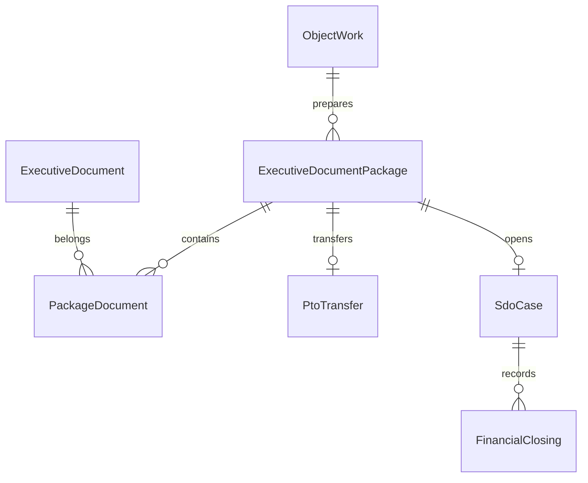

# Основные связи

Полное определение FK, CHECK и индексов — `infra/001_initial.sql`, `infra/002_invariants.sql`. Каждая tenant-связь содержит tenant_id с обеих сторон.

Tenant, User, Attachment, AuditLog, DomainEvent, Notification, RiskSettings, BitrixInstallation и Session — инфраструктурные связи, перечислены в domain-model.md и SQL.
